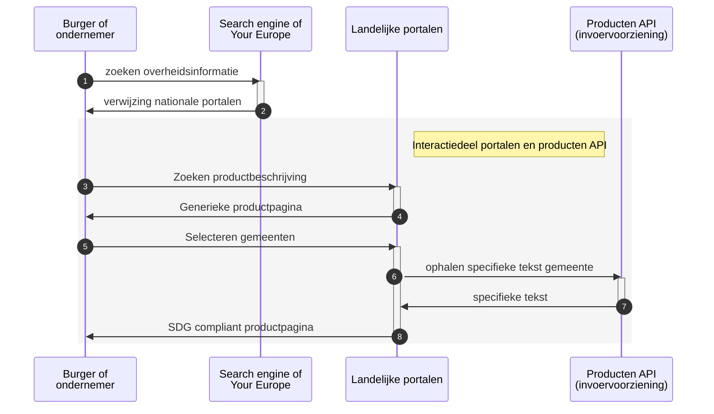
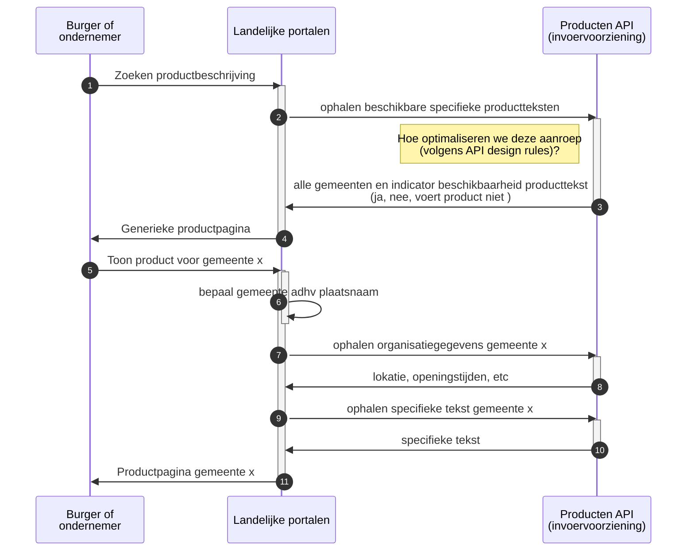
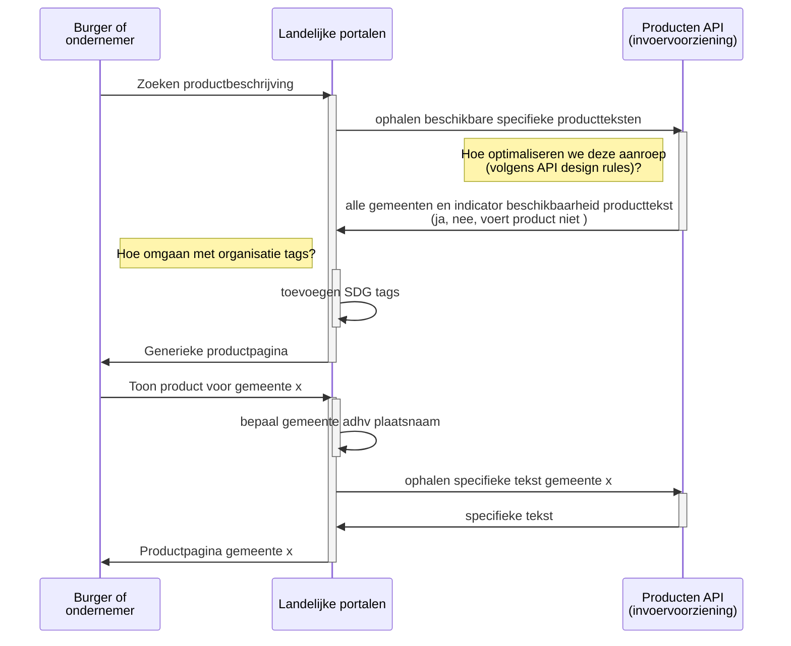
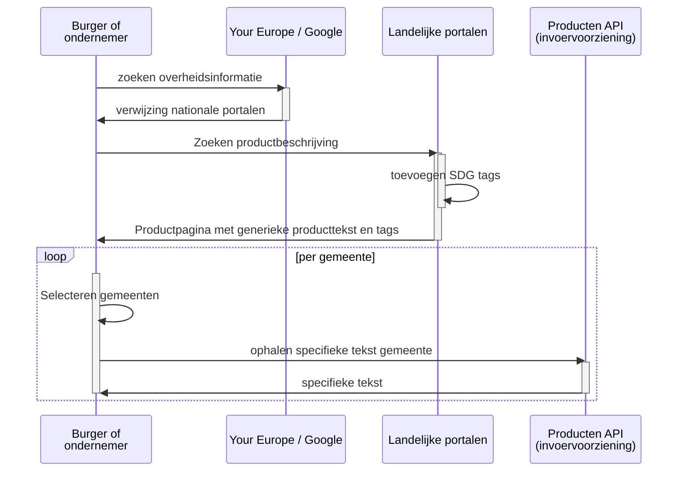
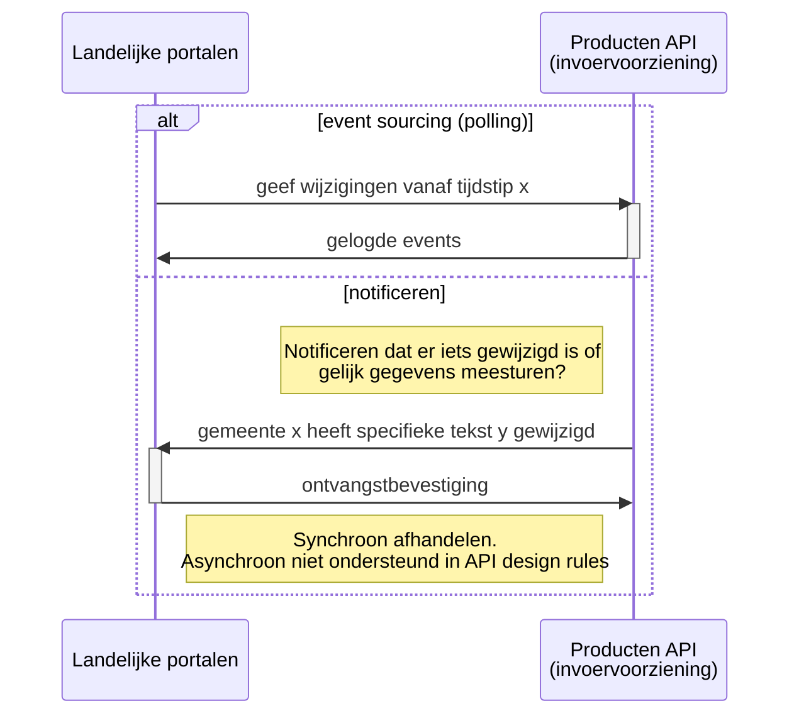
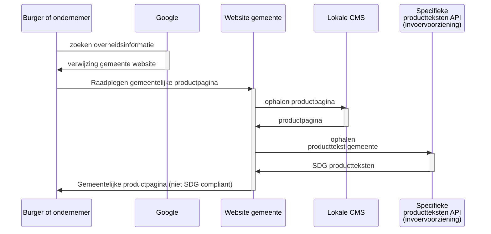
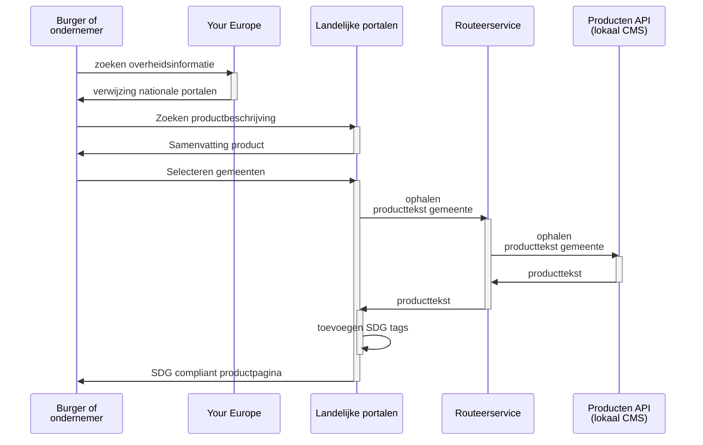
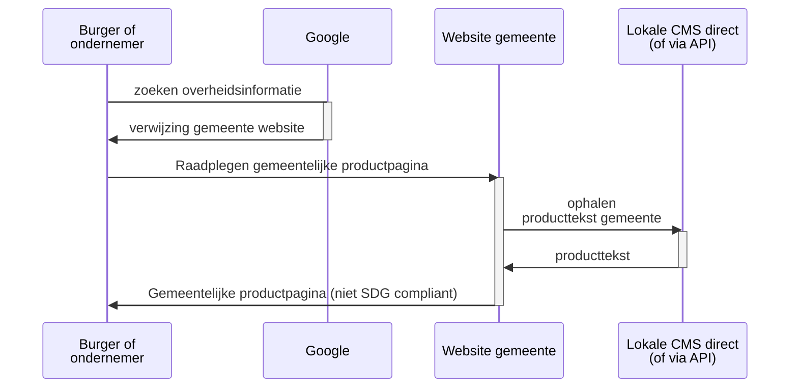

**Inhoud**

[TOC]

[the mermaid live editor](https://mermaid-js.github.io/mermaid-live-editor)

## Variant 1: gedeelde invoervoorziening

### Raadplegen op Landelijk portaal

De burger of ondernemer volgt de weg zoals deze door Europa bedoeld is. Via YourEurope wordt de burger verwezen naar het juiste Nederlandse Nationale portaal. Op het Nationale portaal vindt de burger het product en vraagt van dit product de gegevens van een gemeente op. Het Landelijk portaal haalt deze gegevens op bij de API die door de gedeelde invoorvoorziening wordt aangeboden.

Alle gegevens zijn nu beschikbaar en het Landelijk portaal maakt de SDG productpagina op.

Een SDG productpagina bevat conform SDG verordening SDG tags waardoor de pagina vindbaar en herkenbaar is voor het Your Europe portaal.

#### Globale werking API

_Het landelijke portaal haalt specifieke teksten op_

#### Werking in meer detail (zonder search engine)

#### Werking in meer detail met tags (zonder search engine)

_De specifieke producttekst wordt door de browser van de burger of ondernemer ingevoegd_

### Caching in portaal

Voor een goede gebruikservaring zal het portaal enkele gegevens willen cachen. De API zal hiervoor specifieke bulk opvragingen ondersteunen

#### Wijzigingen sinds laatste raadpleging

### Raadplegen op gemeentelijke website

De burger of ondernemer heeft een vraag en zoekt met Google naar informatie. Via Google wordt de burger verwezen naar de website van een gemeente.

Een gemeentelijke website kan de teksten van zijn eigen productpagina's dubbel beheren naast de teksten in de invoervoorziening. De gemeente kan er ook voor kiezen om de SDG teksten alleen bij de te houden in de invoervoorziening en deze in te voegen in de eigen pagina's. Deze laatste variant is in het onder staande diagram uitgewerkt

De gemeentelijke website haalt de SDG teksten op bij de invoervoorziening en voegt deze in in de eigen productpagina. Hiermee is deze pagina compleet en wordt deze getoond aan de burger

## Variant 2: Beheer SDG teksten in lokaal CMS

### Raadplegen op Landelijk portaal

De burger of ondernemer volgt de weg zoals deze door Europa bedoeld is. Via YourEurope wordt de burger verwezen naar het juiste Nederlandse Nationale portaal. Op het Nationale portaal vindt de burger het product en vraagt van dit product de gegevens van een gemeente op. Het Landelijk portaal vraagt de gemeentelijke gegevens op bij de routeervoorziening. De routeervoorziening verwijst het verzoek door naar de API van de gemeente. Bij de gemeente worden de gegevens opgehaald.

Alle gegevens zijn nu beschikbaar en het Landelijk portaal maakt de SDG productpagina op.

Een SDG productpagina bevat conform SDG verordening SDG tags waardoor de pagina vindbaar en herkenbaar is voor het Your Europe portaal.

### Raadplegen op gemeentelijke website

De burger of ondernemer heeft een vraag en zoekt met Google naar informatie. Via Google wordt de burger verwezen naar de website van een gemeente.

De productpagina en de SDG teksten worden in het lokale CMS beheerd. De website heeft dus alle informatie voor de productpagina in het eigen CMS beschikbaar. Afhankelijk van het CMS wordt de hele productpagina rechtstreeks ingelezen of wordt ook voor de eigen website gebruik gemaakt van API's (bijvoorbeeld Open Webconcept werkt op deze wijze)

De gemeentelijke website haalt de pagian met de SDG teksten op bij het CMS en toont deze aan de burger

