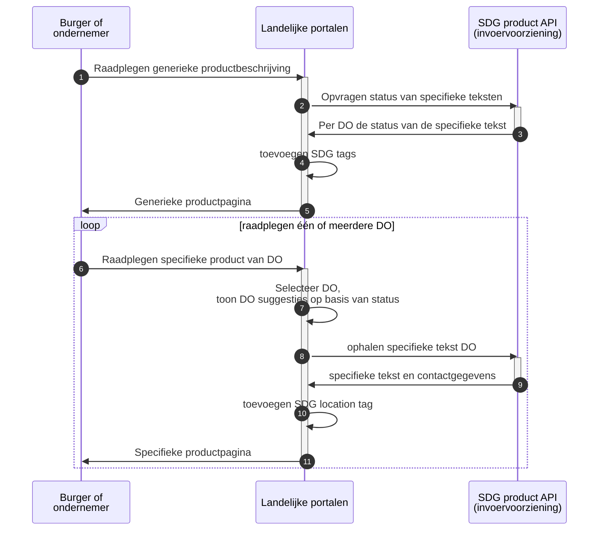
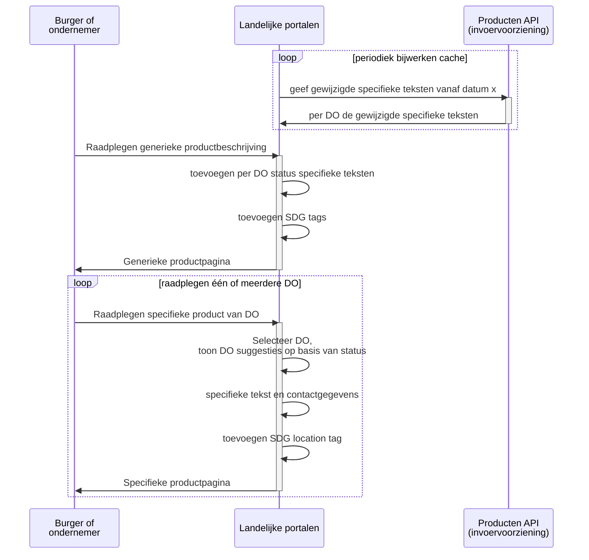
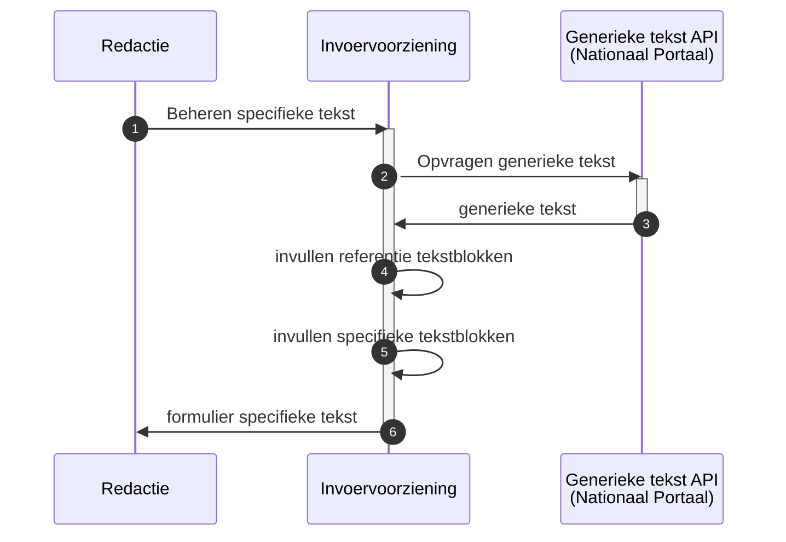
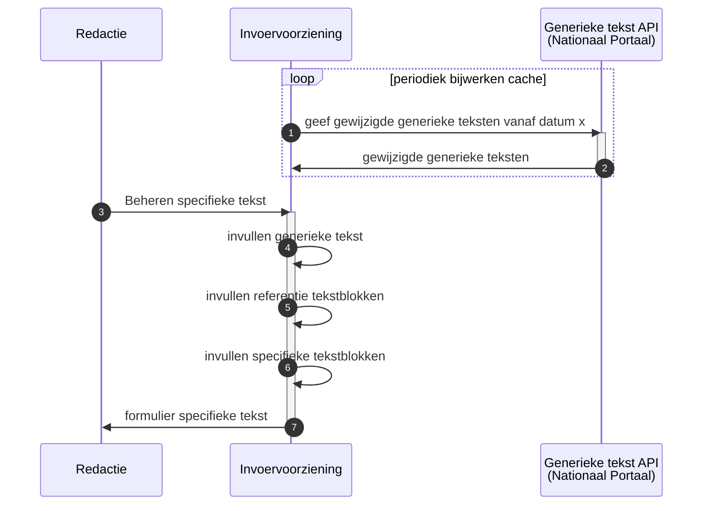

# SDG berichtuitwisselingen

Dit document beschrijft de berichtuitwisselingen tussen de Nationale Portalen en de decentrale overheden. De berichtuitwisselingen zijn uitgewerkt in sequence-diagrammen en vervolgens zijn de benodigde API's ontworpen op basis van het SDG informatiemodel.

Doelstelling van dit document is tweeledig:

- verifieren van het SDG informatiemodel. Bevindingen leiden tot aanpassing over en weer
- discussiedocument voor het afstemmen van de benodigde APIS's

## Openstaande vragen over SDG informatiemodel

1\. Welke organisatie-rollen zijn relevant voor de decentrale overheden?

> Het SDG informatiemodel kent de volgende organisatie-rollen:
>
> - Organisatie voor ondersteuning
> - Organisatie verantwoordelijk voor de decentrale informatie
> - Bevoegd gezag verantwoordelijk voor de procedure
>
> Voor zover nu bekend geldt voor een decentrale overheid dat deze alle 3 de rollen zelf vervult.
>
> - Welk organisatietype gaan we gebruiken als identificatie van de DO?
> - Welke organisatietypen gaan we retourneren in antwoorden?

2\. Er is geen attribuut contactgegevens. Deze zijn impliciet onderdeel van de 3 organisatie-rollen

> Het SDG informatiemodel is hier niet compleet. In de invoervoorziening is dit nu als volgt uitgewerkt:
>
> - een organisatie heeft contactgegevens
>   - e-mail
>   - website
>   - telefoon
>   - en één of meerdere locaties
>     - bezoekadres
>     - openingstijden
>
> Bij een product wordt aangegeven op welke locatie(s) deze beschikbaar is

## Specifieke teksten berichtuitwisselingen

De burger of ondernemer heeft via een search engine of YourEurope het product op een Nationale Portaal gevonden. De burger of ondernemer kan van dit product vervolgens de specifieke teksten van een decentrale overheid opvragen. Het Landelijk portaal haalt deze gegevens op bij de SDG product API bij de invoorvoorziening (van de DO).

Alle gegevens zijn nu beschikbaar en het Landelijk portaal maakt de SDG productpagina op.

Een SDG productpagina bevat conform SDG verordening SDG tags waardoor de pagina vindbaar en herkenbaar is voor het Your Europe portaal.

### Raadplegen NP met live teksten

### Raadplegen NP met cache teksten

Het ondernemersplein heeft aangegeven de specifieke teksten te willen cachen. De specifieke teksten in het cache worden periodiek geactualiseerd.

De SDG product API zal hiervoor specifieke bulk opvragingen ondersteunen

### Invoervoorziening API

#### Opvragen status van specifieke teksten

Geef van het gevraagde product een lijst van de decentrale overheden en per DO of het product beschreven is.

- Request:
  - UPN
- Reply
  - UPN
  - alle DO
    - registratiestatus (wel/niet beschreven)
    - registratiestatusToelichting
    - Als status wel beschreven
      - ProductAanwezig (ja/nee)
      - ProductAanwezigToelichting

#### Opvragen specifieke tekst

Geef de specifieke tekst van een organisatie in een bepaalde taal en voor een bepaalde doelgroep

- Request:
  - Organisatie, UPN, Taal, Doelgroep
- Reply
  - VerantwoordelijkeOrganisatie (of BevoegdeOrganisatie??)
    - **contactgegevens**
  - ProductAanwezig
  - ProductAanwezigToelichting
  - NPSpecifiekeLink
  - **locatie**
  - Alle Productvariant
    - ProductTitelDecentraal
    - SpecifiekeTekst
    - VerwijzingLinks
    - DatumWijziging
  - Productvariant (specifiek procedure art 10)
    - BeschikbareTalen
    - ProcedureBeschrijving
    - Vereisten
    - Bewijs
    - BezwaarEnBeroep
    - KostenEnBetaalmethoden
    - UitersteTermijn
    - WTDBijGeenReactie
    - DecentraleProcedureLink

#### Actualiseren kopie specifieke teksten

Geef van alle organisaties de gewijzigde specifieke teksten waarvoor geldt DatumWijziging > DatumVanaf

- Request:
  - DatumVanaf, Doelgroep
- Reply
  - alle organisaties
    - VerantwoordelijkeOrganisatie (of BevoegdeOrganisatie??)
      - **contactgegevens**
    - alle Product (specifiek informatie art 9)
      - UPN_URI
      - Doelgroep
      - Alle talen
        - Taal
        - ProductAanwezig
        - ProductAanwezigToelichting
        - NPSpecifiekeLink
        - **locatie**
        - Alle Productvariant
          - ProductTitelDecentraal
          - SpecifiekeTekst
          - VerwijzingLinks
          - DatumWijziging
        - Productvariant (specifiek procedure art 10)
          - BeschikbareTalen
          - ProcedureBeschrijving
          - Vereisten
          - Bewijs
          - BezwaarEnBeroep
          - KostenEnBetaalmethoden
          - UitersteTermijn
          - WTDBijGeenReactie
          - DecentraleProcedureLink

## Generieke teksten berichtuitwisselingen

De invoervoorziening vraagt de generieke teksten op om deze te tonen in de invoervoorziening. De generieke tekst wordt getoond aan de gemeente redactie bij het schrijven van een specifieke tekst.

### Redactie specifieke teksten met live generieke teksten

### Redactie specifieke teksten met cache generieke teksten

### Opvragen generieke tekst

Geef de generieke tekst van een product

- Request:
  - UPN_URI
- Reply
  - VerantwoordelijkeOrganisatie
  - Product (generiek)
    - Alle talen
      - Taal
      - ProductTitel
      - GeneriekeTekst
      - KorteOmschrijving
      - VerwijzingLinks
      - NationaleLink
      - DatumCheck

### Actualiseren generieke tekst

Geef de gewijzigde generieke teksten waarvoor geldt DatumCheck > DatumVanaf

- Request:
  - DatumVanaf
- Reply
  - VerantwoordelijkeOrganisatie
  - Alle producten
    - Product (generiek)
      - UPN_URI
      - Alle talen
        - Taal
        - ProductTitel
        - GeneriekeTekst
        - KorteOmschrijving
        - VerwijzingLinks
        - NationaleLink
        - DatumCheck

## Mermaid diagrammen

De diagrammen in dit document zijn gemaakt in Mermaid. Mermaid maakt het mogelijk om diagrammen in code te beschrijven, waarna deze dynamisch gerendered wordt.

Een browser ondersteund het renderen van mermaid niet standaard, maar er zijn hier extensies voor beschikbaar.
In Chrome/Vivaldi kun je gebruik maken van bijvoorbeeld de extensie *mermaid-diagrams*.

Om zelf met mermaid te experimenteren: zie [the mermaid live editor](https://mermaid-js.github.io/mermaid-live-editor)